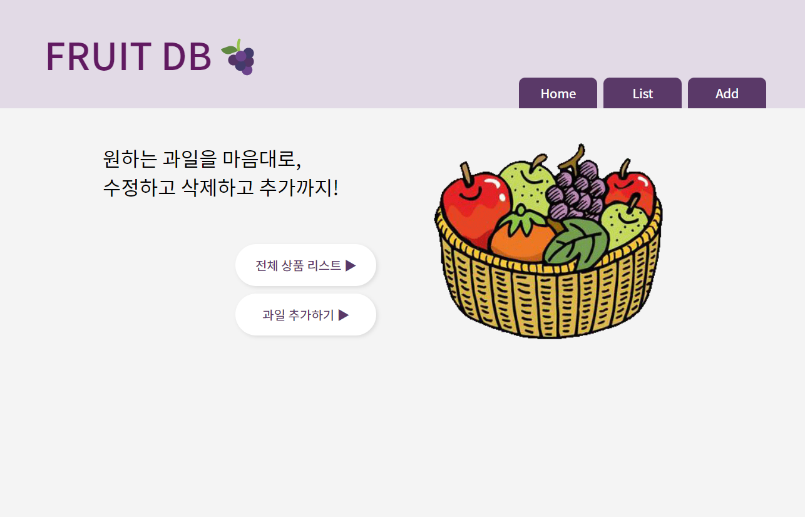
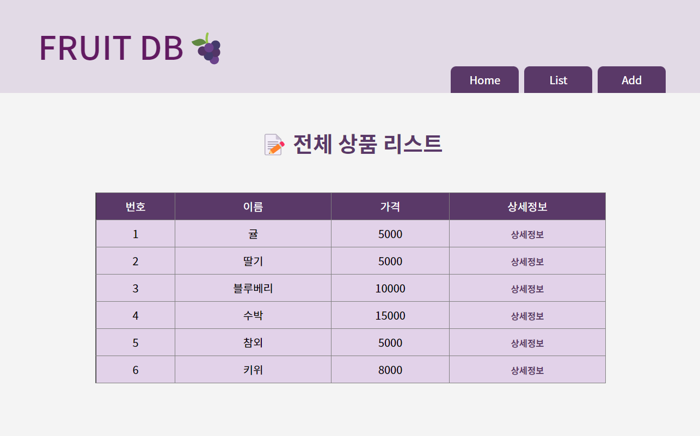
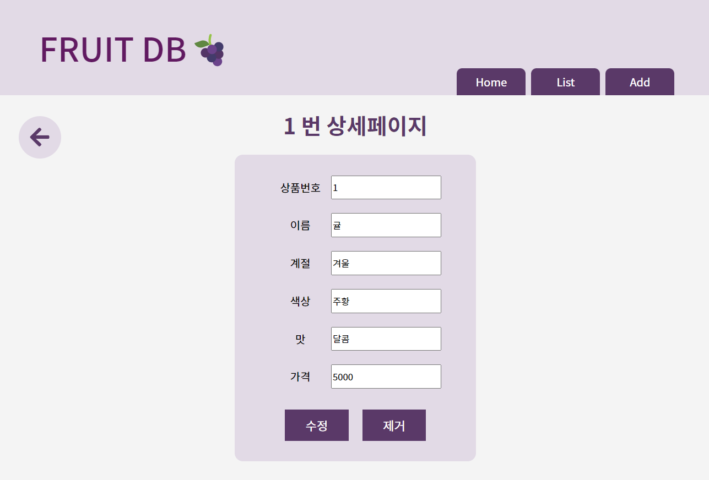
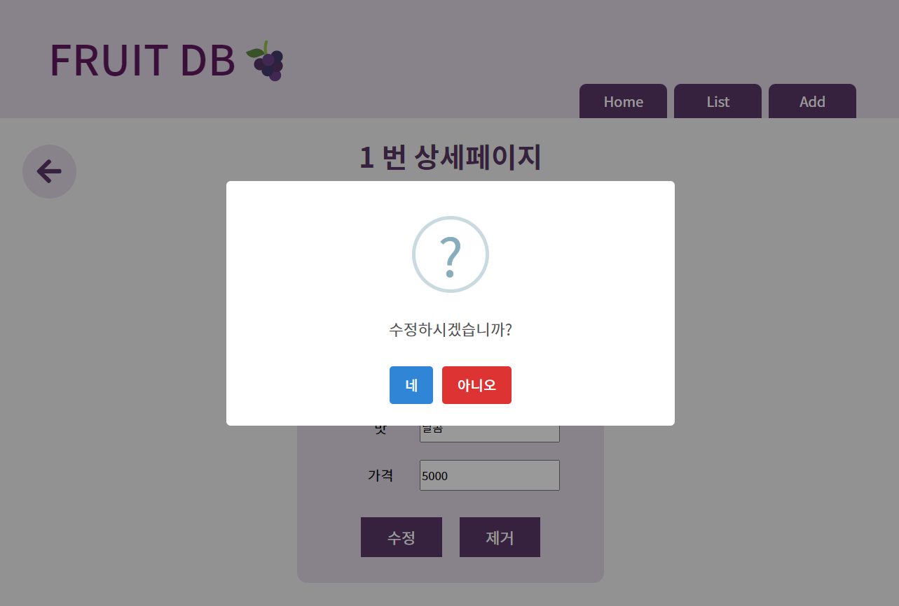
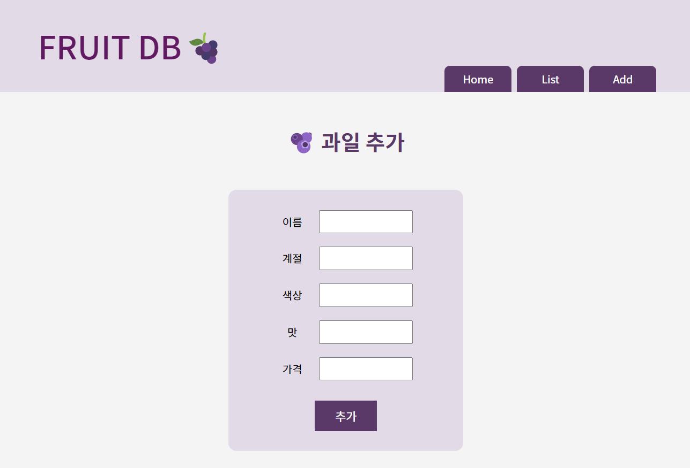
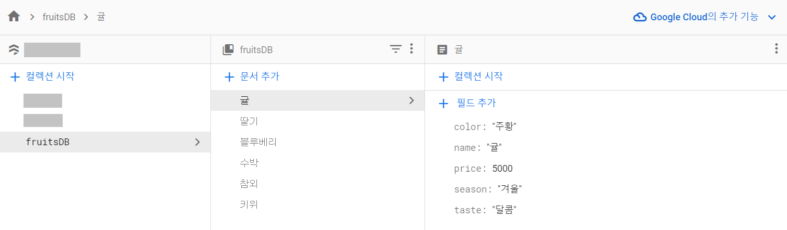

<h1>Fruit DB</h1>

SeSAC의 React 수업을 바탕으로 개발한 Fruit DB 프로젝트입니다.

과일의 목록을 나타내고 조회, 추가, 수정, 삭제가 가능한 사이트입니다.

Firebase의 KEY값을 감추고 배포 시도중입니다. 해결시 바로 업로드 하겠습니다

 
 

  
  
Home 페이지 (main)

   
  
  
List 페이지

   
  
  
ListInfo 페이지

   
  
  
수정 삭제 추가시 표현되는 sweetalert2

   
  
  
Add 페이지

   
  
  
Firebase 연동

 
 

## 기술 스택

   

 
 

## 구현 기능

- react-router-dom을 사용한 페이지 이동 기능
- Firebase의 데이터를 연동하여 값을 조회, 저장, 수정, 삭제하는 기능
- onChange이벤트와 useState를 활용하여 input의 값의 변화를 인지하고 저장하거나 변경하여 출력
- useEffect를 활용하여 무분별한 리렌더링 방지
- 추가, 수정, 삭제 기능이 작동할 때만 리렌더링
- sweetalert2를 통한 alert창 구현
- SCSS를 통한 스타일링
   
